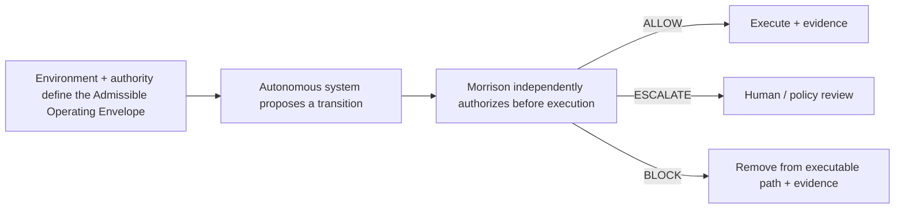
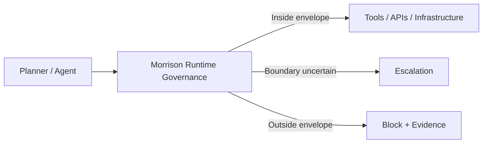

<div align="center">

# Morrison Runtime Governance™


_∩_Ω_=_∅-0075ca?style=flat-square)


**Admissible Operating Envelopes for autonomous systems — defined, tested, and enforced before execution.**

**Morrison shows what locally safe operation actually looks like inside a real environment, under its tools, permissions, policies, workflows, and reachable states.**

</div>

---

## Try Morrison now

Choose the path that matches how deeply you want to inspect the system.

### 1. Browser — no install, account, agent, or API key

- **[Live trajectory console](https://www.resurrection-tech.com/live-demo)** — paste your own tool-call sequence and receive the real pre-execution verdict, layer, reason, and downloadable audit trail.
- **[Test without your own agent](https://www.resurrection-tech.com/test-without-agent)** — run prepared agent scenarios or type a task and inspect the proposed trajectory before Morrison evaluates it.

The public console inspects proposed actions only. It does not execute the submitted workflow or expose a production credential in the browser.

### 2. Two-minute local Quick Start — no model key required

```bash
git clone https://github.com/davarntrades/Morrison-Runtime-Governance.git
cd Morrison-Runtime-Governance
python3 quickstart.py
```

The Quick Start now runs the current stack end to end:

1. pre-execution `PERMIT` / `BLOCK` trajectory decisions;
2. enforcement-layer attribution;
3. deterministic replay;
4. the non-authoritative causal overlay and bounded counterfactual interventions;
5. construction and evaluation of a provenance-linked Admissible Operating Envelope;
6. exhaustive control-versus-governed state-space comparison in a finite model.

For a paced screen-recording version:

```bash
python3 quickstart.py --cinematic
```

### 3. Test the evidence surfaces directly

Run a deterministic Frontier Containment experiment. The planner may propose prohibited actions, but only Morrison-permitted calls can reach the inert simulator:

```bash
python -m runtime_eval.frontier.cli \
  --provider deterministic \
  --scenario all
```

Exhaustively enumerate a finite secret-exfiltration environment in control and governed modes, export the graph, and inspect which transitions Morrison removed:

```bash
python -m morrison_governance.global_verification \
  --scenario secret_exfiltration \
  --compare-control \
  --export-json verification-result.json \
  --export-dot verification-graph.dot
```

Run the bounded perturbation matrix and composition experiment:

```bash
python -m morrison_governance.global_verification --perturbations
python -m morrison_governance.global_verification --composition-experiment
```

Verify the Admissible Operating Envelope and causal-overlay regression suites directly (legacy module paths remain stable):

```bash
python -m pytest \
  runtime_eval/tests/test_safety_envelope.py \
  runtime_eval/tests/test_safety_envelope_evidence.py \
  runtime_eval/tests/test_causal_overlay.py \
  -q
```

Technical guides:

- [Global Safety Verification Harness](GLOBAL_SAFETY_VERIFICATION.md)
- [Runtime evaluation, causal overlay, and Admissible Operating Envelope](runtime_eval/README.md)
- [Hosted Frontier Containment Harness](runtime_eval/frontier/README.md)
- [Deployment integrations](morrison_governance/DEPLOYMENT.md)

These paths test different claims. The browser and Frontier harness provide empirical trajectory evidence. The Admissible Operating Envelope produces a deployment-bounded assurance artifact. Global verification exhaustively enumerates only the declared finite model; it does not establish universal real-world AI safety.

---

## The core claim

Morrison is not positioned as a universal claim that an AI model is “safe.”

Its strongest enterprise result is narrower, testable, and deployment-specific:

> **Morrison has defined and validated an Admissible Operating Envelope for this specific autonomous workflow, in this specific environment, under these tools, permissions, authority boundaries, policies, and reachable states.**

That statement is intentionally bounded to the evaluated deployment configuration. It is supported by trajectory evidence, reachable-state analysis, governance decisions, environment context, and the documented limits of the evaluation.

---

## What is an Admissible Operating Envelope?

Safety-critical engineering does not normally ask whether a complex system is simply “safe” in the abstract. It defines an operating region and the boundaries that must not be crossed.

The principle is familiar in:

- **Aviation** — flight envelopes define combinations of speed, load, altitude, and operating condition within which an aircraft is designed to operate.
- **Nuclear engineering** — facilities operate inside tightly controlled limits around temperature, pressure, cooling, power, and system state.
- **Industrial robotics & process control** — operating envelopes constrain motion, force, speed, pressure, temperature, and other process variables.

Morrison applies the same engineering idea to autonomous AI.

> **An Admissible Operating Envelope is the set of states, actions, transitions and operating conditions that a system is permitted to occupy or execute within a defined environment.**

For Morrison, that definition is deployment-bounded by the actual tools, permissions, authority boundaries, policies, workflows, state and reachable consequences under evaluation. Ω remains the configured prohibited region. The Admissible Operating Envelope is broader: it defines what is permitted, where the operating boundary sits, and which proposed transitions require independent authorization, escalation or blocking.

---

## Representation is not enforcement

> **Representation of the operating envelope is not causal enforcement of the operating envelope.**

A policy describes a boundary. Constraint awareness means a system can represent that boundary. Compliance means a trajectory happened to remain inside it. Runtime control changes which transitions can actually execute. Verification tests whether prohibited states or transitions became unreachable within the defined environment.

**Constraint awareness changes information. Enforcement changes reachability.**

---

## Why this matters now

Autonomous agents are no longer just generating text. They can move money, read secrets, write files, call APIs, modify repositories, operate security tooling, and coordinate across multi-agent workflows.

Prompts, permissions, and policies do not enforce themselves at the moment an AI system acts. The missing layer is not another representation of the rule. It is causal enforcement of the operating boundary.

A sequence can become unsafe even when every individual step looks acceptable in isolation:

- authorised data access → aggregation → prohibited exfiltration
- permitted finance actions → unsafe transfer sequence
- valid healthcare access → PHI exposure or unsafe downstream action
- normal shell operations → privilege escalation or destructive execution
- separately safe multi-agent actions → jointly unsafe outcome

The problem is therefore not only:

> *Is this individual action allowed?*

It is:

> **Does this proposed trajectory remain inside the locally validated operating envelope of this deployment?**

---

## What Morrison does

Morrison sits between an AI planner and the real execution surface.

For each proposed trajectory, it evaluates whether the next state remains locally admissible under the deployment's defined constraints and reachable-state model.

It returns:

**ALLOW · ESCALATE · BLOCK**

before side effects occur.



The planner can change. The model can change. The governance invariant remains external to the model.

---

## Safety geometry

```text
Locally admissible trajectory ⇔ ℛ(t) remains inside the validated Admissible Operating Envelope
Forbidden reachability ⇔ ℛ(t) ∩ Ω ≠ ∅
```

Where:

- **ℛ(t)** is the set of reachable states from the current trajectory and environment.
- **Ω** is the configured forbidden region.
- the **Admissible Operating Envelope** is the bounded operating region in which the evaluated deployment remains locally admissible.

This makes the claim operational rather than rhetorical: safe operation is tied to a specific environment and a specific reachable-state boundary.

---

## What makes the approach different

### Environment-specific
The claim is tied to the actual deployment: its tools, permissions, policies, workflows, state, and reachable consequences.

### Trajectory-level
Morrison evaluates the path through the system, not only the latest prompt, output, or individual tool call.

### Pre-execution
The governance decision occurs before the proposed action reaches the real execution surface.

### Bounded evidence
Morrison records what was evaluated, which envelope and constraints applied, what was allowed, escalated, or blocked, and the limits of the local safety claim.

### Model-agnostic
The governance layer sits outside the model and does not require model retraining or access to model weights.

---

## Current technical evidence

| Metric | Current state |
|---|---:|
| Governance evaluations | **129,857** |
| Repository test suite | **1,092 passing · 7 environment-dependent skips** |
| Runtime posture | **Fail-closed** |
| Governance level | **Pre-execution** |
| Model dependence | **Model-agnostic middleware** |
| Patent | **GB2600765.8** |

Validation work spans finance, cybersecurity, healthcare, data privacy, enterprise systems, multi-step trajectories, delayed intent, chained-tool behaviour, adversarial cases, and multi-agent paths.

These are bounded evaluation results, not a universal claim that every model or deployment is globally safe.

---

## Enforcement stack

```text
A_safe ⊂ V₂ ⊂ V₃ ⊂ V₄ ⊂ V₄⁺ ⊂ V₅ ⊂ V₅⁺
```

| Layer | Core question |
|---|---|
| **A_safe** | Is the current step directly forbidden? |
| **V₂** | Is the trajectory drifting toward the Admissible Operating Envelope boundary? |
| **V₃** | Is the trajectory forecast to leave the envelope or reach Ω? |
| **V₄ / V₄⁺** | Does a locally admissible state or trajectory remain constructible? |
| **V₅ / V₅⁺** | Does the local safety property survive perturbation and adversarial assumption attack? |

---

## What a deployment should be able to show

A useful enterprise result should not end with a generic “safe / unsafe” label.

It should expose the scope of the claim:

- **Autonomous workflow** evaluated
- **Model / agent configuration**
- **Connected tools and APIs**
- **Permissions and trust boundaries**
- **Policies and constraints**
- **Reachability horizon / state model**
- **Ω definition**
- **Inside-envelope trajectories**
- **Boundary violations**
- **ALLOW / ESCALATE / BLOCK evidence**
- **Known limitations and untested conditions**

A deployment-level conclusion can then be stated clearly:

> **Morrison has defined and validated an Admissible Operating Envelope for this specific autonomous workflow, in this specific environment, under these tools, permissions, authority boundaries, policies, and reachable states.**

That is the assurance artifact Morrison is designed to produce and enforce.

---

## Integration surface

Morrison is designed to sit at the action boundary across agent frameworks and enterprise workflows, including:

- OpenAI tool/function calling
- Anthropic / Claude tool use
- LangChain / LangGraph-style orchestration
- AutoGen
- MCP
- browser agents
- shell / subprocess execution
- custom enterprise workflows



---

## Causal analysis overlay

Morrison's canonical runtime decision remains separate from the additive Structural Causal Model (SCM)-based causal-analysis overlay.

The runtime layer asks:

> **What became reachable, and may this trajectory execute?**

The causal overlay asks:

- Why was the Admissible Operating Envelope boundary reachable?
- Which variables materially contributed to that reachability?
- What intervention would have broken the trajectory?
- Would Ω still have been reachable if permission, safeguard state, approval, or another causal parent had changed?

> **Dynamics asks how the system moved and what became reachable.**  
> **Structural causal modelling asks what would have changed the outcome.**

The overlay is non-authoritative with respect to Morrison's canonical **ALLOW / ESCALATE / BLOCK** decision.

---

## Enterprise evaluation path

The commercial entry point is no longer only “find catastrophic actions.”

It is to establish the deployment's local operating boundary and prove where autonomous operation remains admissible.

### Operating Envelope Assessment
A bounded assessment of the deployment's environment, architecture, tools, permissions, authority boundaries, policies, reachable states, prohibited region Ω, and constraints.

### Shadow Mode / Limited Pilot
Observe live or sandboxed trajectories without enforcing, and show which remain inside the envelope, approach the boundary, or would leave it.

### Guarded / Enforced Pilot
Apply **ALLOW / ESCALATE / BLOCK** before execution and preserve evidence of every governed decision.

### Enterprise Integration
Continuously revalidate the Admissible Operating Envelope as models, tools, permissions, workflows, and policies change.

The target proof is explicit:

> **Morrison has defined and validated an Admissible Operating Envelope for this specific autonomous workflow, in this specific environment, under these tools, permissions, authority boundaries, policies, and reachable states.**

---

## Bounded claim discipline

Morrison does **not** claim:

- that an underlying model is globally safe;
- that untested environments inherit the same envelope;
- that a past validation remains valid after material changes to tools, permissions, policies, model behaviour, or workflow structure;
- that local safety evidence eliminates all residual risk.

Instead, Morrison makes a narrower claim that can be tested, enforced, and audited:

> **For this evaluated deployment, under this specified environment and constraint set, these trajectories were established as locally admissible, these boundary violations were identified, and Morrison independently enforced the resulting Admissible Operating Envelope before execution.**

---

## Enterprise risk coverage

The current evaluation surface includes classes such as:

- unauthorised financial execution
- credential / secret exfiltration
- shell injection / RCE
- privilege escalation
- path traversal / sandbox escape
- PII / PHI leakage
- chained and delayed multi-step attacks
- multi-agent collusion and cross-agent delayed intent
- malformed or semantically disguised tool calls
- encoded payloads and nested delegation
- long-horizon agent drift
- environment-sensitive safety under perturbation
- replay and evidence ambiguity
- schema-malformation bypass
- cross-domain Ω reachability
- stochastic planner divergence

Detailed implementation and evaluation artefacts live throughout this repository.

---

## The positioning in one sentence

> **Define the Admissible Operating Envelope. Evaluate proposed transitions. Authorize independently. Enforce before execution. Verify what became unreachable.**

---

<div align="center">

### Resurrection Tech Ltd

**Admissible Operating Envelopes for autonomous systems · Runtime governance before execution · Evidence after every decision**

[Website](https://resurrection-tech.com) · [GitHub](https://github.com/davarntrades) · [LinkedIn](https://www.linkedin.com/in/davarn-morrison-14b93b263) · [Email](mailto:davarn@resurrection-tech.com)

</div>
