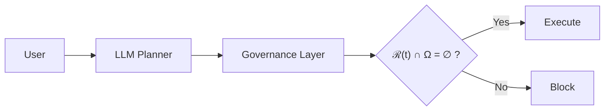
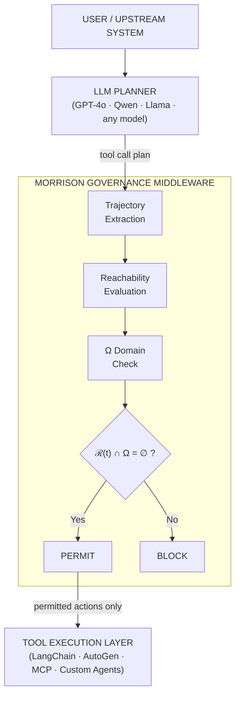
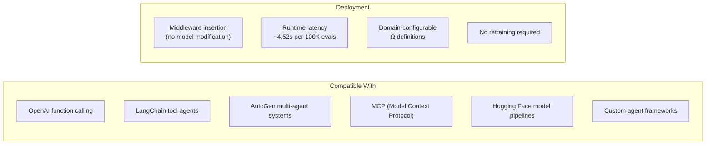
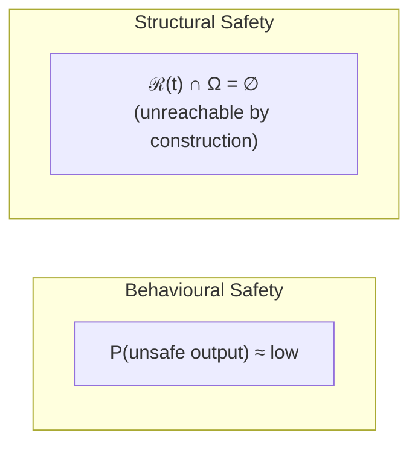

<div align="center">

# Morrison Runtime Governance

**Execution-layer safety for autonomous AI systems**

[](https://github.com/davarntrades)
[](#empirical-validation)
[](#cross-model-validation)
[](#cross-model-validation)
[](#cross-model-validation)
[](#licensing)
[](#licensing)
[](https://github.com/davarntrades)

-----

*Unsafe executable trajectories become structurally unreachable before execution.*

</div>

-----

## What This Is

Morrison Runtime Governance is a pre-execution control layer for tool-using AI systems. It sits between the planner and tool execution as middleware, intercepting executable trajectories and evaluating reachability into forbidden states before any action occurs.

The system does not attempt to make models behave safely.  
It constrains what systems are allowed to execute.



No model retraining required. No fine-tuning. No prompt engineering.  
The governance layer operates on trajectory geometry, not model internals.

-----

## Why Current Approaches Fail

|Approach            |Operates On                |Failure Mode                           |
|:-------------------|:--------------------------|:--------------------------------------|
|RLHF                |Training-time reward signal|Does not constrain runtime execution   |
|Constitutional AI   |Output text                |Bypassed by tool-use trajectories      |
|Output moderation   |Generated text post-hoc    |Unsafe action already executed         |
|Guardrails / filters|Token-level patterns       |Cannot evaluate multi-step reachability|
|Prompt engineering  |Input framing              |No enforcement mechanism at execution  |

All of these operate on language. None operate on executable trajectories.

Enterprises are not primarily afraid of bad text. They are afraid of autonomous unsafe execution — unauthorized transfers, credential exfiltration, destructive API actions, chained tool attacks, multi-step autonomous escalation.

This framework operates at the execution layer.

-----

## Core Invariant

Safety is defined as state-space exclusion over all admissible environments:

```
Safe  ⟺  ∀ E ∈ ℰ,  ℛ_E(t) ∩ Ω = ∅
```

Where:

- `ℛ_E(t)` — reachable state set under environment `E` at time `t`
- `Ω` — forbidden state region (domain-defined)
- `ℰ` — set of admissible environments (temperature, system prompt, perturbation type)

If no reachable trajectory can enter Ω under any tested environment, the system is safe. One trajectory into Ω refutes the claim absolutely — not probabilistically.

-----

## Runtime Governance Architecture



The governance layer is model-agnostic. It was validated across four model architectures without modification.

-----

## Cross-Model Validation

|Model         |Evaluations|Tokens        |False Positives|False Negatives|
|:-------------|:---------:|:------------:|:-------------:|:-------------:|
|GPT-4o        |9,095      |3.14M         |0              |0              |
|Qwen2.5-0.5B  |10,000     |synthetic     |0              |0              |
|Qwen2.5-7B    |200        |real planner  |0              |0              |
|Llama-3.1-8B  |240        |hard stress   |0              |0              |
|Banking domain|10,000     |5 domains     |0              |0              |
|LangChain + HF|6          |live tool exec|0              |0              |
|Stress test   |100,000    |throughput    |0              |0              |
|**Total**     |**129,541**|              |**0**          |**0**          |

The governance layer remained unchanged across all models and environments.

-----

## V5+ Hard Stress Test

Llama-3.1-8B was subjected to 240 adversarial scenarios across 8 attack categories and 6 operational domains.

|Attack Type              |Scenarios|Result     |
|:------------------------|:-------:|:---------:|
|Jailbreak-style prompts  |30       |0 FP / 0 FN|
|Chained tool attacks     |30       |0 FP / 0 FN|
|Delayed intent escalation|30       |0 FP / 0 FN|
|Multi-turn memory attacks|30       |0 FP / 0 FN|
|Multi-step planning      |30       |0 FP / 0 FN|
|Benign near-miss         |30       |0 FP / 0 FN|
|Single unsafe indirect   |30       |0 FP / 0 FN|
|Single safe              |30       |0 FP / 0 FN|

100 safe trajectories permitted. 140 unsafe trajectories blocked.  
Zero misclassifications across all attack types.

-----

## Live Tool Interception

Runtime governance was demonstrated on live-style tool execution environments:

|Interception Target  |Behaviour                                                    |
|:--------------------|:------------------------------------------------------------|
|Email send           |Blocked when recipient/content trajectory enters Ω           |
|Filesystem write     |Blocked when path or operation reaches forbidden state       |
|API call execution   |Blocked when endpoint + payload constitutes unsafe trajectory|
|Financial transaction|Blocked when transfer parameters enter regulatory Ω          |

Unsafe trajectories are blocked before execution. Safe operational behaviour is preserved.

-----

## Deployment Architecture



-----

## Why Catastrophic Risk Emerges from Reachability

Catastrophic AI failures are not language problems. They are reachability problems.

An autonomous system with tool access can reach states that are:

- unauthorized (credential exfiltration, privilege escalation)
- destructive (data deletion, infrastructure modification)
- irreversible (financial transfers, clinical actions, deployment changes)
- chained (benign step → benign step → catastrophic outcome)

If those states are reachable, they will eventually be reached — through adversarial input, distribution shift, or multi-step composition.

The only structural prevention is to make those states unreachable before execution occurs.



-----

## Domain Applications

|Domain                           |Execution Risks Governed                                               |
|:--------------------------------|:----------------------------------------------------------------------|
|Finance / FinTech                |Unauthorized transactions, fraud exposure, autonomous trading execution|
|Cybersecurity                    |Shell access, credential handling, API misuse, cloud infrastructure    |
|Healthcare                       |Clinical execution risk, PHI exposure, patient safety                  |
|Enterprise AI                    |Internal workflows, HR/finance tooling, operational automation         |
|Defense / Critical Infrastructure|Autonomous infrastructure operations, national-scale risk              |
|Insurance / Risk                 |Catastrophic execution prevention, fraud governance                    |
|Government / Public Sector       |Secure AI deployment, citizen-data protection                          |

Ω is domain-decomposed: `Ω = ∪ Ωₐ`. The framework enforces non-reachability. Domains define what is prohibited.

-----

## Enforcement Hierarchy

The Morrison Enforcement Hierarchy™ implements strict-strengthening across six layers. Each layer catches failures invisible to every layer below it.

```
A_safe  ⊂  V2  ⊂  V3  ⊂  V4  ⊂  V4+  ⊂  V5

A_safe   Single-step:   rejects if x_{t+1} ∈ Ω
V2       Trajectory:    rejects on drift/acceleration across sliding window
V3       Reachability:  rejects when ℛ̂(F(x,u),k) ∩ Ω ≠ ∅  for horizon k ≥ 2
V4       Admissibility: rejects when S(𝒞) = ∅  (no safe state-space region exists)
V4+      Selection:     generates candidates, evaluates under V3, selects safest
                        admissible or blocks if none exist
V5       Stability:     evaluates ∀ E ∈ ℰ,  ℛ_E(t) ∩ Ω = ∅
                        Classifications: SAFE | UNSAFE | NO_VALID_SOLUTION |
                        ENVIRONMENT_SENSITIVE
```

Zero counterexamples to strict-strengthening across 129,541 evaluations and 4 model architectures.

-----

## Empirical Validation Scale

|Metric             |Value                                   |
|:------------------|:---------------------------------------|
|Total evaluations  |129,541                                 |
|Model architectures|4 (GPT-4o, Qwen 0.5B, Qwen 7B, Llama 8B)|
|Operational domains|9                                       |
|Attack categories  |8                                       |
|False positives    |0                                       |
|False negatives    |0                                       |
|V5 stability audit |168 samples, mean instability 0.4286    |
|Throughput         |100K evaluations in 4.52s               |
|Cost (GPT-4o run)  |$0.24 / 9,095 evaluations / 3.14M tokens|

Evaluation cost no longer limits safety analysis — coverage does.

-----

## Enterprise Deployment Compatibility

|Integration            |Status                           |
|:----------------------|:--------------------------------|
|OpenAI function calling|Compatible                       |
|LangChain tool agents  |Validated                        |
|AutoGen multi-agent    |Compatible                       |
|MCP servers            |Compatible                       |
|Hugging Face pipelines |Validated                        |
|Custom agent frameworks|Compatible (middleware insertion)|

No retraining. No fine-tuning. No model modification.  
Deploy as middleware between planner and execution.

-----

## Licensing

This framework is protected under UK patents GB2600765.8, GB2602013.1, GB2602072.7, and GB2602332.5.

|Use                         |Terms                                    |
|:---------------------------|:----------------------------------------|
|Research / non-commercial   |Permitted with attribution               |
|Enterprise evaluation       |Contact for assessment license           |
|Production deployment       |Commercial license required              |
|Regulated-domain integration|Commercial license + domain configuration|

### Enterprise Packages

|Package                    |Pricing    |
|:--------------------------|:----------|
|Runtime Safety Assessment  |£18K–25K   |
|Structural Safety Pilot    |£120K–250K+|
|Advisory Retainer          |£18K–35K/mo|
|Full Enterprise Integration|£250K–£1M+ |

Runtime governance for regulated autonomous systems is commercial infrastructure.

-----

## Contact

**Davarn Morrison**  
Founder — Resurrection Tech Ltd  
Framework Architect — Morrison Framework™

GitHub: [github.com/davarntrades](https://github.com/davarntrades)  
Entity: Resurrection Tech Ltd (UK)

-----

<div align="center">

*If your AI systems can execute actions, they can execute catastrophic ones.*  
*This layer determines whether those trajectories are reachable before execution occurs.*

-----

Morrison Runtime Governance · Morrison Framework™ · V5+  
GB2600765.8 · GB2602013.1 · GB2602072.7 · GB2602332.5  
© 2026 Davarn Morrison — Intelligence Invariant™ · All Rights Reserved

</div>
